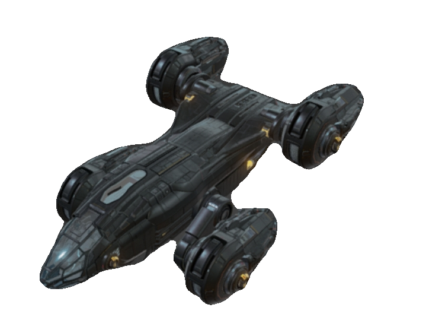

# Ganiom
Adds a galaxy with some races, heavily work in progress. 
Inspired by [Galactic War](https://github.com/1010todd/Galactic-War). 
 
To find the galaxy, go to hatysa in the far north.
# New Races
These are the new races, 
Lannen
Ik'mat 
Itaien 
Onnnari
## Dialogs 
Serbajkil has news 
Vic'Na has news
## Shipyards
Gainen has a shipyard
Serbajkil does not have shipyard, but their ships can be bought with the omnis cheat plugin
### Fleets
Gainen, The Between, Hisair, Communist Ganiom Kem relicnain, Bruchaven Issarei, Serbajkil and Bruchaven Mekrut have fleets
### Ships

**Gainen Colossus does not show**

# Planned Storyline

Communist Ganiom-Hisair War

Vic'Na-Onnari War

Serbajkil, Foren, Gainen-Hisair War

Intergalactic Foren-Hisair War

The Between-Onnari War

The Between-Hisair War

Meghafokluaya Hisair-Hisair War

J-1 - J-2 Union

## Changelogs

V0.071 - New Serbajkil Ship "Alkorel", and new Serbajkil weapon.

V0.070 - Added the Gainescaf, G12 Attack, Qari Hexa and Festafar, Mekrut fleets, Hisair and Mekrut hails.

V0.061 - Bugfixes

V0.053 - Added the new Severosinsi and Macavtre Gainen ships, and a new outfitter(Gainen Outfitter). 

V0.052 - Bugfix

V0.051 - Added missions, that don't even work for some reasom

