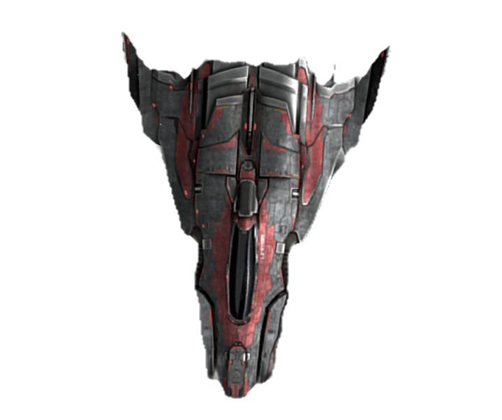
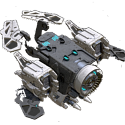

# Ganiom
Adds a galaxy with some races, heavily work in progress. 
Inspired by [Galactic War](https://github.com/1010todd/Galactic-War). 
 
To find the galaxy, go to hatysa in the far north.
# New Races
These are the new races, 
Bruchaven, 
Foren,
Vic'Na 
And Serbajkil
## Dialogs 
Serbajkil has news 
## Shipyards
Gainen has a shipyard
### Fleets
Gainen, The Between, Hisair, Communist Ganiom And Kem relicnain have fleets(only Hisair, Gainen and Communist Ganiom are currently used)
### Ships

**Gainen Colossus does not show**

# Planned Storyline

Communist Ganiom-Hisair War

Vic'Na-Onnari War

Serbajkil, Foren, Gainen-Hisair War

Intergalactic Foren-Hisair War

The Between-Onnari War

The Between-Hisair War

Meghafokluaya Hisair-Hisair War

J-1 - J-2 Union

## Changelogs

V0.053 - Added the new Severosinsi and Macavtre Gainen ships, and a new outfitter(Gainen Outfitter). 

V0.052 - Bugfix

V0.051 - Added missions, that don't even work for some reason

